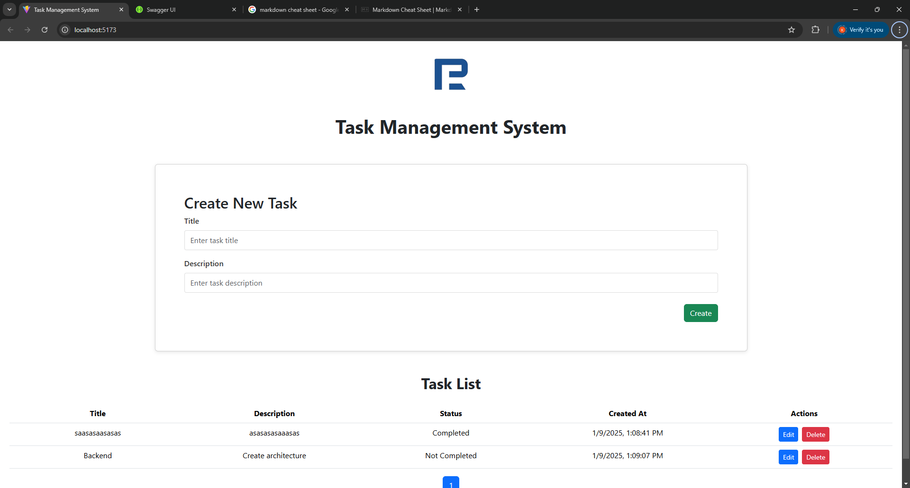
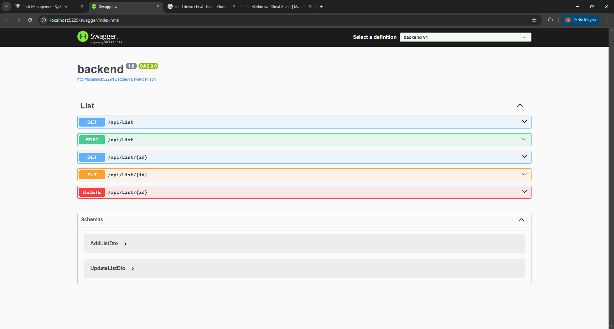

# Task Management System

A modern and intuitive task management system built with **React (TypeScript)** on the frontend and **.NET Core 8.0 LTS** on the backend. This system helps users efficiently manage their tasks with a clean and user-friendly interface.

---

## Project Overview

The Task Management System is designed to help users organize, track, and manage their tasks with ease. It offers core features such as task creation, updating, deletion, and marking tasks as complete. The application also supports real-time updates, making it ideal for managing tasks in dynamic environments.

The system is built using React (TypeScript) on the frontend for a fast, modern, and responsive UI, and .NET 8.0 Core LTS for the backend to handle business logic and database operations efficiently.

---

## Features

Task Management: Add, edit, delete, and mark tasks as complete with a user-friendly interface.
Real-Time Updates: Task lists are dynamically updated without needing to reload the page, ensuring a seamless user experience.
Swagger API Documentation: Integrated Swagger UI for easy API testing and documentation.

## Tech Stack

### Frontend

- **React** with **TypeScript**
- **CSS Modules** for styling
- **Axios** for API communication
- **Vite** for fast and optimized development and build processes

### Backend

- **.NET 8.0 Core LTS**
- **Entity Framework Core** for database management
- **MSSQL** for lightweight data storage
- **Swagger** for API documentation and testing

### Database

- **MSSQL** for lightweight data storage

---

## Implementation

### Frontend Implementation

The frontend of the Task Management System is built with React (TypeScript), ensuring a strong type system while providing flexibility in building dynamic UIs. CSS Modules are used for styling, ensuring that styles are scoped to the component level, preventing global style conflicts.

Key components include:

- Task List: Displays all tasks in the system.
- Task Form: For creating and editing tasks.
- Task Item: Displays individual task information with options to mark it as completed or delete it.

Axios is used for API communication, making it easy to send requests to the backend and dynamically update the UI.
Vite is used for building and running the React app, offering fast reload times and optimized builds for production.

### Backend Implementation

The backend of the system is powered by .NET Core 8.0 LTS, providing the infrastructure for handling RESTful API requests.

Key features of the backend include:

- Task Management API: Exposes CRUD operations (Create, Read, Update, Delete) for managing tasks.
- JWT Authentication: Secures access to the task management system by using JSON Web Tokens (JWT) for user authentication.
- Entity Framework Core: Used for interacting with the SQLite database. EF Core handles database schema updates and migrations automatically.
- Swagger UI: Integrated Swagger provides an interactive interface to view and test the API endpoints.

Create the context first for storing data in the database through backend:

```bash
public class ListDBContext:DbContext
    {
        public ListDBContext(DbContextOptions dbContextOptions) : base(dbContextOptions)
        {

        }

        public required DbSet<List> Lists { get; set; }

    }
```

Connection settings json code is used to connect the backend to the database. Make sure to add in appsettings.json file:

```bash
"ConnectionStrings": {
    "DefaultConnection": "Data Source={server-name};Initial Catalog={db-name};Integrated Security=True;Connect Timeout=30;Encrypt=False;TrustServerCertificate=False;ApplicationIntent=ReadWrite;MultiSubnetFailover=False"
  }
```

Add this snippet into Program.cs:

```bash
builder.Services.AddDbContext<ListDBContext>(options =>
{
    var connectionString = builder.Configuration.GetConnectionString("DefaultConnection");
    options.UseSqlServer(connectionString);
});
```

### Database Implementation

The database is set up using SQLite, which is lightweight and easy to configure for a small project like this. Entity Framework Core handles the database interaction, allowing you to perform tasks like migrations and updates effortlessly.

- MSSQL Database: The task.db file holds all task data.
- EF Core Migrations: Used to apply schema changes to the database. The dotnet ef migrations add Init command creates the initial migration, and dotnet ef database update applies the migration to the database.

---

## Installation

### Prerequisites

Ensure that the following are installed in the system:

- React (TypeScript) + Vite - 18.3.1
- .NET 8.0 SDK
- MSSQL (installed and configured)

### Clone the Repository

To clone the repository into your local computer:

```bash
git clone https://github.com/kumararuben03/task-management.git
cd task-management
```

### For Frontend

To install the required dependencies:

```bash
cd frontend
npm install
```

To start the development server:

```bash

npm run dev
```

### For Backend

To install packages:

```bash
dotnet add package <package-name> --version <package-version>
```

To start the backend server:

```bash
cd backend
dotnet watch run
```

### For Database

To generate a migration file that describes changes done to the model:

```bash
dotnet ef migrations add Init
```

To update the database (MSSQL, MYSQL, any database of choice):

```bash
dotnet ef database update
```

## Implementation

## Screenshots


_UI of the Task Management System_


_Swagger UI for API Documentation of the Task Management System_
